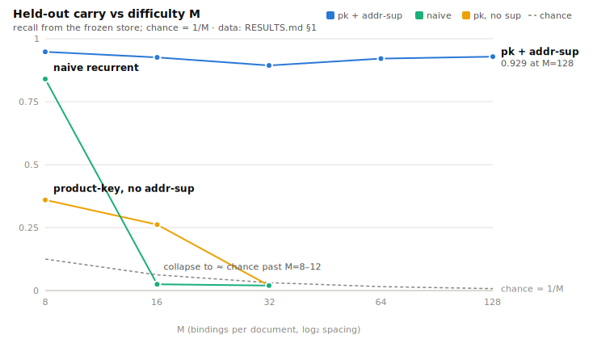
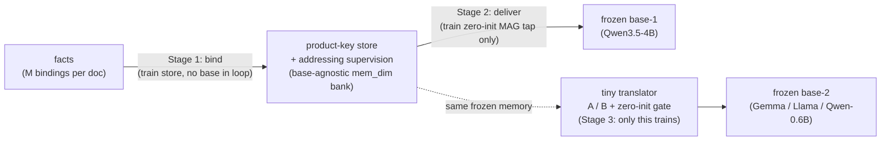

# memory-organ

**Attach a long-term associative memory to a frozen LLM — and carry that same memory to a *different*
frozen LLM through a tiny learned translator.**

A research preview of a mechanism for *base-agnostic* memory: bind facts into a compact memory module,
deliver them into a frozen base model via a zero-initialized gated tap, and transfer the *same frozen
memory* to a second frozen base (different size, different tokenizer, different model family) with a
small affine translator. No base-model weights are trained at any point.

> ### ⚠️ Status & caveats — read first
> - **Research preview, days old, not peer-reviewed.** It may not survive real data or independent
>   reproduction.
> - **The task is synthetic** — a name→cargo dictionary-recall probe, not real-world knowledge. This
>   demonstrates a *mechanism*, not a product.
> - Results are **3-seed** (tight error bars); **AMD ROCm**-developed, CPU/CUDA portability untested.
> - **An AI wrote the implementation** under a human's direction — see
>   [How this was built](#how-this-was-built). What separates this from unreviewed AI output is that
>   every number below has a chance baseline and an ablation, and the three times we were wrong are
>   [in the record](DISCLOSURES.md#corrections-we-were-wrong-three-times).
>
> The full caveat list is in **[DISCLOSURES.md](DISCLOSURES.md)**.

## Origin

This started in conversation, while sorting some Gemini hype from reality. Claude was explaining why you
*can't* just strip layers out of different models and sandwich them into a new base — a model's **hidden
states aren't a shared interface**; each model's residual stream is its own private coordinate system.
Mid-way through outlining where you'd inject a memory ([Memory-as-Context vs Memory-as-Gate](ACKNOWLEDGMENTS.md)),
the words "hidden states" landed, and Pat — meaning only to nudge — said: *"hang on, I remember a project
that was doing something with translating between hidden states."* That project was
[RecursiveMAS](ACKNOWLEDGMENTS.md), and the nudge reoriented everything: the same fact that makes
layer-sandwiching impossible (hidden states don't transfer) means you can't drop a memory built on one
model into another either — **you'd need a translator**, and someone had already shown you could learn
one. Combine that with a [Titans](ACKNOWLEDGMENTS.md)-style memory and you get the question this repo
chases. The full story is in [DIARY.md](DIARY.md#entry-0--origin).

## The result

Three things are demonstrated end-to-end, on one memory store, at honest difficulty. *M* is the
discrimination difficulty (pick the right item out of *M* candidates; chance = 1/*M*).

**1. Capacity.** The naive recurrent memory walls out past M≈8–12. A product-key store *with its
addressing-supervision loss* holds flat through M=128 (held-out recall carry, chance shrinking from
0.125 to 0.008):

| M     | 8 | 16 | 32 | 64 | 128 |
|-------|------|------|------|------|------|
| carry | 0.948 | 0.926 | 0.894 | 0.921 | 0.929 |

<picture>
  <source media="(prefers-color-scheme: dark)" srcset="docs/assets/carry-vs-m-dark.svg">
  
</picture>

*(The uncompressed-KV upper bound and every ablation are in [RESULTS.md §1](RESULTS.md); figure
regenerated by `tools/make_carry_figure.py`.)*

**2. Delivery + transfer.** That same store, bound, delivered into a frozen Qwen base, then transferred
to a *different* frozen base via a tiny affine translator (single-token answers, M=8, **3-seed mean**,
`no_memory` = 0.000 throughout):

| stage | result | chance |
|---|---|---|
| Stage-1 carry | 0.950 ±0.003 | 0.125 |
| delivery into frozen Qwen | 0.944 ±0.009 | 0.125 |
| transfer → frozen **Gemma** | 0.942 ±0.020 | 0.125 |
| transfer → frozen **Llama-3.2-3B** (foreign tokenizer + arch) | **0.656** | 0.125 |

Near-deterministic across seeds, and the **cross-family Llama** transfer (a genuinely foreign model —
tiktoken vocab, different architecture and width) passes with a clean 0.000 floor: the translator isn't
riding Qwen-family similarity. The naive store, for contrast, cannot even *bind* the harder M=64 case
that this store delivers + transfers at ~0.92.

> **The honest edge — largely closed.** The table above uses *single-token* answers. **2-token real-word
> answers** were the hard case, and both halves now work: the *store side* — addressing 0.000 → **0.964**,
> same-base delivery 0.486 → **0.883** (disjoint per-position codebooks) — and *cross-base transfer*,
> which a plain affine translator stalled on (0.393) but a **per-position + non-linear translator** lifts
> to **0.812** (~84% of ceiling, no_memory 0.000). Both fixes are the same idea — *go per-position* — at
> opposite ends of the pipeline. It's a strong pass, **not** single-token parity (~0.94), so we call it
> *largely closed*, not solved. The four-experiment hunt is in [RESULTS.md §4](RESULTS.md).

**3. Knowledge editing.** The strongest result: the memory doesn't just *add* facts, it *overwrites* what
a frozen model already believes. Given real facts the base demonstrably knows (a probe→filter gate
confirms it), the memory bound to *counterfactual* values makes the base emit the wrong answer while
suppressing its own prior — and it works **same-base and cross-family** (`no_memory` = 0.000 throughout):

| | validity gate (base knows prior) | mem-on → counterfactual | true prior, mem-on |
|---|---|---|---|
| same-base (Qwen) | 1.000 | **0.996** | 0.004 |
| cross-family (Gemma) | 1.000 | **0.996** | 0.004 |

The base *knows* France→Paris; the memory makes it say France→**Tokyo** (0.996) while collapsing Paris to
0.004 — including into a frozen model it was never built on, through a 13M translator. Details + the
BOS-bug we caught and fixed in [RESULTS.md §6](RESULTS.md). (Facts here are real but curated; real-shaped
phrasing — prose, varied relations, multi-token — is validated in §5.)

> **The honest limit — the curated win does *not* survive the real benchmark yet.** Run against the real
> **ROME CounterFact** set (21,919 records) with **locality** and **generalization** metrics the curated
> table can't measure, the edit still *delivers* (mem-on 0.961 vs 0.000 no-memory) — but the run
> **invalidates itself** (the base doesn't hold the priors under the eval phrasing: validity gate 0.164,
> a filter/eval prompt-format mismatch), **leaks** to neighbouring facts (locality −0.199), and only
> **weakly generalizes** to paraphrases (0.103). Curated editing was a best case; real-benchmark editing is
> *delivered-but-not-yet-valid*. Full numbers and the concrete next steps in
> [RESULTS.md §7](RESULTS.md) ([#16](https://github.com/patcarter883/memory-organ/issues/16)).

See **[RESULTS.md](RESULTS.md)** for every number with its baseline and the full story including the
[three corrections](DISCLOSURES.md#corrections-we-were-wrong-three-times), and **[METHOD.md](METHOD.md)** for
how the mechanism works.

## How this was built

The research direction — the hypotheses, what to test, the originating idea — is **Pat Carter's**. The
implementation — kernels, math, experiment harness, falsification methodology, and this writeup — is
**Claude's** (Anthropic's Opus 4.x), working as an agent under Pat's direction. We say so plainly; the
full statement and reasoning are in [DISCLOSURES.md](DISCLOSURES.md#how-this-was-built).

## Where this is going

This is the reproducible artifact. The larger ambition — *one canonical memory that any frozen model
can attach to* ("Titans for everyone") — and what is proven versus aspirational is laid out in
**[ROADMAP.md](ROADMAP.md)**.

## The pipeline in one picture



No base-model weights are ever trained. The bank the tap reads is the store's own `mem_dim` space —
built from base-1's embeddings, never base-2's — which is what makes the transfer leg possible.

## Reproduce

> Pure PyTorch (`torch`, `transformers`, `numpy`); models download from their original sources. Run
> from the repo root, either as a module (`python -m cam.<driver>`) or as a file (`python cam/<driver>.py`).
>
> The commands below show the shape of each experiment. For the **exact per-table recipe** (seeds,
> step counts, the flags behind every published number) see **[REPRODUCING.md](REPRODUCING.md)**; to
> report a reproduction or a non-reproduction, see **[CONTRIBUTING.md](CONTRIBUTING.md)**. On 16 GB
> cards, `CAM_EVAL_BATCH_CAP` (default 128) shrinks the eval forward if you OOM — memory-only,
> accuracy-neutral.

```bash
# capacity ladder (product-key store + addressing supervision)
python -m cam.bind_msweep --store pk --addr-sup-weight 1.0 --pk-read-heads 8 --Ms 8,16,32,64,128 \
    --bind-steps 6000 --batch 16 --lr 1e-3 --seed 20260625

# end-to-end: bind -> deliver into frozen base-1 -> transfer to frozen base-2
python -m cam.recall_mag --store pk --addr-sup-weight 1.0 --M 8 \
    --bind-steps 6000 --seed 20260625 --save-ckpt ckpt/m8.pt
python -m cam.recall_v1  --load-ckpt ckpt/m8.pt --M 8 --seed 20260625 --base2 unsloth/gemma-3-4b-pt

# multi-token cargo: disjoint per-position store + higher-capacity per-position translator
python -m cam.recall_mag --store pk --readout perpos --perpos-key disjoint --cargo-tokens 2 \
    --addr-sup-weight 1.0 --pk-read-heads 8 --M 8 --bind-steps 6000 --seed 20260625 --save-ckpt ckpt/mt.pt
python -m cam.recall_v1  --load-ckpt ckpt/mt.pt --M 8 --cargo-tokens 2 --xlator perpos-mlp \
    --seed 20260625 --base2 unsloth/gemma-3-4b-pt

# real knowledge (first cut): natural-language facts "<Subject> lives in <Object>." (phrasing survives)
python -m cam.recall_mag --store pk --addr-sup-weight 1.0 --M 8 --phrasing natural \
    --bind-steps 6000 --seed 20260625 --save-ckpt ckpt/nat.pt
python -m cam.recall_v1  --load-ckpt ckpt/nat.pt --M 8 --seed 20260625 --base2 unsloth/gemma-3-4b-pt

# knowledge editing: probe the frozen base for real country->capital priors it KNOWS, keep those, put a
# DERANGED capital in memory, and override the base's own prior (mem-on flips France->Paris to France->Tokyo).
# PROBE -> FILTER -> EDIT runs in one pass; the VALID/INVALID gate fires on no_mem prior-acc (same-base valid).
python -m cam.recall_mag --store pk --addr-sup-weight 1.0 --M 8 --phrasing counterfactual \
    --bind-steps 6000 --seed 20260625 --save-ckpt ckpt/cf.pt
```

## License & credit

Apache-2.0 (see `LICENSE`). This work descends directly from RecursiveMAS, Titans, product-key memory,
and relative representations — full credit in **[ACKNOWLEDGMENTS.md](ACKNOWLEDGMENTS.md)**.
